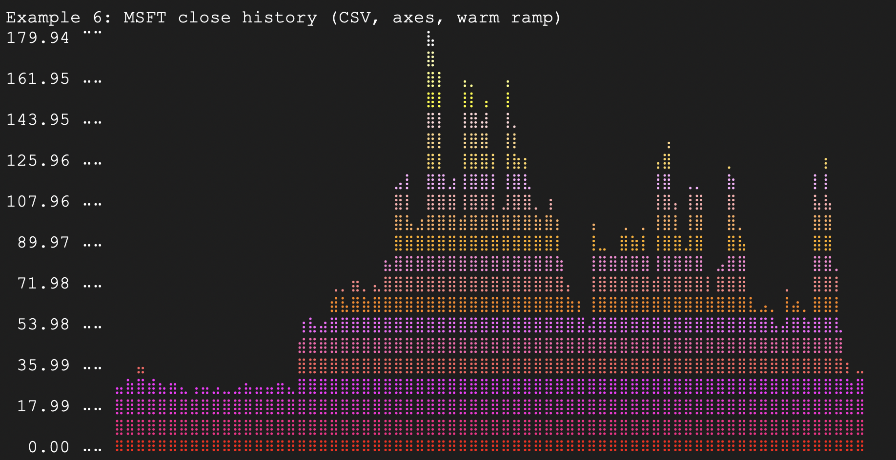

# dotchart

A small, fast CLI that reads numeric values and prints a Braille-based terminal chart with optional axes.

## Build

```bash
cmake -S . -B build
cmake --build build -j
```

## Run

```text
% utils/sinewave.sh | dotchart  
⠀⠀⠀⠀⠀⠀⠀⠀⣠⣴⣶⣿⣿⣿⣷⣶⣤⡀⠀⠀⠀⠀⠀⠀⠀⠀⠀⠀⠀⠀⠀⠀⠀⠀⠀⠀⠀⠀⠀⠀⠀⠀⠀⠀⠀⠀⠀⠀⠀⠀
⠀⠀⠀⠀⠀⢀⣴⣿⣿⣿⣿⣿⣿⣿⣿⣿⣿⣿⣷⣄⠀⠀⠀⠀⠀⠀⠀⠀⠀⠀⠀⠀⠀⠀⠀⠀⠀⠀⠀⠀⠀⠀⠀⠀⠀⠀⠀⠀⠀⠀
⠀⠀⠀⢀⣴⣿⣿⣿⣿⣿⣿⣿⣿⣿⣿⣿⣿⣿⣿⣿⣷⣄⠀⠀⠀⠀⠀⠀⠀⠀⠀⠀⠀⠀⠀⠀⠀⠀⠀⠀⠀⠀⠀⠀⠀⠀⠀⠀⠀⠀
⠀⢀⣴⣿⣿⣿⣿⣿⣿⣿⣿⣿⣿⣿⣿⣿⣿⣿⣿⣿⣿⣿⣷⣄⠀⠀⠀⠀⠀⠀⠀⠀⠀⠀⠀⠀⠀⠀⠀⠀⠀⠀⠀⠀⠀⠀⠀⠀⠀⠀
⠤⠾⠿⠿⠿⠿⠿⠿⠿⠿⠿⠿⠿⠿⠿⠿⠿⠿⠿⠿⠿⠿⠿⠿⠦⢤⣤⣤⣤⣤⣤⣤⣤⣤⣤⣤⣤⣤⣤⣤⣤⣤⣤⣤⣤⣤⣤⣤⣤⣤
⠀⠀⠀⠀⠀⠀⠀⠀⠀⠀⠀⠀⠀⠀⠀⠀⠀⠀⠀⠀⠀⠀⠀⠀⠀⠀⠙⢿⣿⣿⣿⣿⣿⣿⣿⣿⣿⣿⣿⣿⣿⣿⣿⣿⣿⣿⣿⣿⠟⠁
⠀⠀⠀⠀⠀⠀⠀⠀⠀⠀⠀⠀⠀⠀⠀⠀⠀⠀⠀⠀⠀⠀⠀⠀⠀⠀⠀⠀⠙⢿⣿⣿⣿⣿⣿⣿⣿⣿⣿⣿⣿⣿⣿⣿⣿⣿⠟⠁⠀⠀
⠀⠀⠀⠀⠀⠀⠀⠀⠀⠀⠀⠀⠀⠀⠀⠀⠀⠀⠀⠀⠀⠀⠀⠀⠀⠀⠀⠀⠀⠀⠙⠿⣿⣿⣿⣿⣿⣿⣿⣿⣿⣿⣿⡿⠟⠁⠀⠀⠀⠀
⠀⠀⠀⠀⠀⠀⠀⠀⠀⠀⠀⠀⠀⠀⠀⠀⠀⠀⠀⠀⠀⠀⠀⠀⠀⠀⠀⠀⠀⠀⠀⠀⠈⠙⠻⠿⣿⣿⣿⡿⠿⠛⠉⠀⠀⠀⠀⠀⠀⠀
```

```text
% utils/sinewave.sh | dotchart -y
 1.000000 ⠉⠉ ⠀⠀⠀⠀⠀⠀⠀⠀⣠⣴⣶⣿⣿⣿⣷⣶⣤⡀⠀⠀⠀⠀⠀⠀⠀⠀⠀⠀⠀⠀⠀⠀⠀⠀⠀⠀⠀⠀⠀⠀⠀⠀⠀⠀⠀⠀⠀⠀⠀⠀
             ⠀⠀⠀⠀⠀⢀⣴⣿⣿⣿⣿⣿⣿⣿⣿⣿⣿⣿⣷⣄⠀⠀⠀⠀⠀⠀⠀⠀⠀⠀⠀⠀⠀⠀⠀⠀⠀⠀⠀⠀⠀⠀⠀⠀⠀⠀⠀⠀⠀⠀
 0.500000 ⠤⠤ ⠀⠀⠀⢀⣴⣿⣿⣿⣿⣿⣿⣿⣿⣿⣿⣿⣿⣿⣿⣿⣷⣄⠀⠀⠀⠀⠀⠀⠀⠀⠀⠀⠀⠀⠀⠀⠀⠀⠀⠀⠀⠀⠀⠀⠀⠀⠀⠀⠀⠀
             ⠀⢀⣴⣿⣿⣿⣿⣿⣿⣿⣿⣿⣿⣿⣿⣿⣿⣿⣿⣿⣿⣿⣷⣄⠀⠀⠀⠀⠀⠀⠀⠀⠀⠀⠀⠀⠀⠀⠀⠀⠀⠀⠀⠀⠀⠀⠀⠀⠀⠀
          ⠤⠤⠤⠤⠾⠿⠿⠿⠿⠿⠿⠿⠿⠿⠿⠿⠿⠿⠿⠿⠿⠿⠿⠿⠿⠿⠿⠦⢤⣤⣤⣤⣤⣤⣤⣤⣤⣤⣤⣤⣤⣤⣤⣤⣤⣤⣤⣤⣤⣤⣤⣤⣤
             ⠀⠀⠀⠀⠀⠀⠀⠀⠀⠀⠀⠀⠀⠀⠀⠀⠀⠀⠀⠀⠀⠀⠀⠀⠀⠀⠙⢿⣿⣿⣿⣿⣿⣿⣿⣿⣿⣿⣿⣿⣿⣿⣿⣿⣿⣿⣿⣿⠟⠁
-0.500000 ⠤⠤ ⠀⠀⠀⠀⠀⠀⠀⠀⠀⠀⠀⠀⠀⠀⠀⠀⠀⠀⠀⠀⠀⠀⠀⠀⠀⠀⠀⠀⠙⢿⣿⣿⣿⣿⣿⣿⣿⣿⣿⣿⣿⣿⣿⣿⣿⣿⠟⠁⠀⠀
             ⠀⠀⠀⠀⠀⠀⠀⠀⠀⠀⠀⠀⠀⠀⠀⠀⠀⠀⠀⠀⠀⠀⠀⠀⠀⠀⠀⠀⠀⠀⠙⠿⣿⣿⣿⣿⣿⣿⣿⣿⣿⣿⣿⡿⠟⠁⠀⠀⠀⠀
-1.000000 ⣀⣀ ⠀⠀⠀⠀⠀⠀⠀⠀⠀⠀⠀⠀⠀⠀⠀⠀⠀⠀⠀⠀⠀⠀⠀⠀⠀⠀⠀⠀⠀⠀⠀⠀⠈⠙⠻⠿⣿⣿⣿⡿⠿⠛⠉⠀⠀⠀⠀⠀⠀⠀
```

```text
% utils/sinewave.sh | dotchart -y -x
 1.000000 ⠉⠉ ⠀⠀⠀⠀⠀⠀⠀⠀⣠⣴⣶⣿⣿⣿⣷⣶⣤⡀⠀⠀⠀⠀⠀⠀⠀⠀⠀⠀⠀⠀⠀⠀⠀⠀⠀⠀⠀⠀⠀⠀⠀⠀⠀⠀⠀⠀⠀⠀⠀⠀
             ⠀⠀⠀⠀⠀⢀⣴⣿⣿⣿⣿⣿⣿⣿⣿⣿⣿⣿⣷⣄⠀⠀⠀⠀⠀⠀⠀⠀⠀⠀⠀⠀⠀⠀⠀⠀⠀⠀⠀⠀⠀⠀⠀⠀⠀⠀⠀⠀⠀⠀
 0.500000 ⠤⠤ ⠀⠀⠀⢀⣴⣿⣿⣿⣿⣿⣿⣿⣿⣿⣿⣿⣿⣿⣿⣿⣷⣄⠀⠀⠀⠀⠀⠀⠀⠀⠀⠀⠀⠀⠀⠀⠀⠀⠀⠀⠀⠀⠀⠀⠀⠀⠀⠀⠀⠀
             ⠀⢀⣴⣿⣿⣿⣿⣿⣿⣿⣿⣿⣿⣿⣿⣿⣿⣿⣿⣿⣿⣿⣷⣄⠀⠀⠀⠀⠀⠀⠀⠀⠀⠀⠀⠀⠀⠀⠀⠀⠀⠀⠀⠀⠀⠀⠀⠀⠀⠀
          ⠤⠤⠤⠤⠾⠿⠿⠿⠿⠿⠿⠿⠿⠿⠿⠿⠿⠿⠿⠿⠿⠿⠿⠿⠿⠿⠿⠦⢤⣤⣤⣤⣤⣤⣤⣤⣤⣤⣤⣤⣤⣤⣤⣤⣤⣤⣤⣤⣤⣤⣤⣤⣤
             ⠀⠀⠀⠀⠀⠀⠀⠀⠀⠀⠀⠀⠀⠀⠀⠀⠀⠀⠀⠀⠀⠀⠀⠀⠀⠀⠙⢿⣿⣿⣿⣿⣿⣿⣿⣿⣿⣿⣿⣿⣿⣿⣿⣿⣿⣿⣿⣿⠟⠁
-0.500000 ⠤⠤ ⠀⠀⠀⠀⠀⠀⠀⠀⠀⠀⠀⠀⠀⠀⠀⠀⠀⠀⠀⠀⠀⠀⠀⠀⠀⠀⠀⠀⠙⢿⣿⣿⣿⣿⣿⣿⣿⣿⣿⣿⣿⣿⣿⣿⣿⣿⠟⠁⠀⠀
             ⠀⠀⠀⠀⠀⠀⠀⠀⠀⠀⠀⠀⠀⠀⠀⠀⠀⠀⠀⠀⠀⠀⠀⠀⠀⠀⠀⠀⠀⠀⠙⠿⣿⣿⣿⣿⣿⣿⣿⣿⣿⣿⣿⡿⠟⠁⠀⠀⠀⠀
-1.000000 ⣀⣀ ⠀⠀⠀⠀⠀⠀⠀⠀⠀⠀⠀⠀⠀⠀⠀⠀⠀⠀⠀⠀⠀⠀⠀⠀⠀⠀⠀⠀⠀⠀⠀⠀⠈⠙⠻⠿⣿⣿⣿⡿⠿⠛⠉⠀⠀⠀⠀⠀⠀⠀
              ⢰ ⢰  ⢰  ⢰  ⢰  ⢰  ⢰  ⢰  ⢰  ⢰  ⢰  ⢰  ⢰  ⢰  ⢰  ⢰   ⢰
              3 7 13 19 25 31 37 43 49 56 62 68 74 80 86 92 100
```

```text
% utils/sinewave.sh --offset 1.05 | dotchart -y
2.050000 ⠉⠉ ⠀⠀⠀⠀⠀⠀⠀⢀⣠⣴⣶⣿⣿⣿⣷⣶⣤⣀⠀⠀⠀⠀⠀⠀⠀⠀⠀⠀⠀⠀⠀⠀⠀⠀⠀⠀⠀⠀⠀⠀⠀⠀⠀⠀⠀⠀⠀⠀⠀⠀
            ⠀⠀⠀⠀⠀⣠⣶⣿⣿⣿⣿⣿⣿⣿⣿⣿⣿⣿⣷⣦⡀⠀⠀⠀⠀⠀⠀⠀⠀⠀⠀⠀⠀⠀⠀⠀⠀⠀⠀⠀⠀⠀⠀⠀⠀⠀⠀⠀⠀⠀
1.537500 ⠤⠤ ⠀⠀⠀⣠⣾⣿⣿⣿⣿⣿⣿⣿⣿⣿⣿⣿⣿⣿⣿⣿⣿⣦⡀⠀⠀⠀⠀⠀⠀⠀⠀⠀⠀⠀⠀⠀⠀⠀⠀⠀⠀⠀⠀⠀⠀⠀⠀⠀⠀⠀
            ⠀⣠⣾⣿⣿⣿⣿⣿⣿⣿⣿⣿⣿⣿⣿⣿⣿⣿⣿⣿⣿⣿⣿⣦⡀⠀⠀⠀⠀⠀⠀⠀⠀⠀⠀⠀⠀⠀⠀⠀⠀⠀⠀⠀⠀⠀⠀⠀⠀⠀
1.025000 ⠤⠤ ⣾⣿⣿⣿⣿⣿⣿⣿⣿⣿⣿⣿⣿⣿⣿⣿⣿⣿⣿⣿⣿⣿⣿⣿⣿⣦⡀⠀⠀⠀⠀⠀⠀⠀⠀⠀⠀⠀⠀⠀⠀⠀⠀⠀⠀⠀⠀⠀⠀⣠
            ⣿⣿⣿⣿⣿⣿⣿⣿⣿⣿⣿⣿⣿⣿⣿⣿⣿⣿⣿⣿⣿⣿⣿⣿⣿⣿⣿⣦⡀⠀⠀⠀⠀⠀⠀⠀⠀⠀⠀⠀⠀⠀⠀⠀⠀⠀⠀⣠⣾⣿
0.512500 ⠤⠤ ⣿⣿⣿⣿⣿⣿⣿⣿⣿⣿⣿⣿⣿⣿⣿⣿⣿⣿⣿⣿⣿⣿⣿⣿⣿⣿⣿⣿⣿⣦⡀⠀⠀⠀⠀⠀⠀⠀⠀⠀⠀⠀⠀⠀⠀⣠⣾⣿⣿⣿
            ⣿⣿⣿⣿⣿⣿⣿⣿⣿⣿⣿⣿⣿⣿⣿⣿⣿⣿⣿⣿⣿⣿⣿⣿⣿⣿⣿⣿⣿⣿⣿⣦⣄⡀⠀⠀⠀⠀⠀⠀⠀⠀⣀⣤⣾⣿⣿⣿⣿⣿
0.000000 ⠤⠤ ⠿⠿⠿⠿⠿⠿⠿⠿⠿⠿⠿⠿⠿⠿⠿⠿⠿⠿⠿⠿⠿⠿⠿⠿⠿⠿⠿⠿⠿⠿⠿⠿⠿⠿⠶⠦⠤⠤⠤⠤⠶⠾⠿⠿⠿⠿⠿⠿⠿⠿
```

Note: alignment depends on a monospace font with Braille support. GitHub’s code
blocks use a monospace font, but some fonts render Braille blanks with uneven
spacing.

## Color Example

MSFT close history (10+ years) rendered with a custom color ramp:



## Command Line Options

Usage:
```
dotchart [OPTIONS] [FILE]
```

Input:
- `-F`, `--field-sep SEP`  
  Field separator. Default: auto (commas + whitespace). Accepts `\t` and `\n`.
- `-f`, `--file FILE`  
  Read from FILE instead of stdin.
- `-c`, `--column N`  
  Use column N (1-based) as numeric y values. Enables column mode.
- `--x-column N`
  Use column N (1-based) as literal x-axis labels. Enables column mode.

Layout:
- `-W`, `--width COLS|PCT%`  
  Output width. Default: fit-to-data, capped by terminal width.
- `-H`, `--height ROWS`  
  Output height in braille rows (default: 9).
- `-T`, `--title TEXT`  
  Title printed above the chart.

Scaling:
- `-M`, `--max VALUE`  
  Force max scale (default: auto).
- `-m`, `--min VALUE`  
  Force min scale (default: auto).
- `-S`, `--signed`  
  Force signed chart (baseline at 0).

Axes:
- `-x`, `--x-axis[=FMT]`  
  Show x-axis labels (default format: `%d`).
- `--x-min-axis[=FMT]`
  Mark strict local minima and label their 1-based indices (default format: `%d`).
- `-y`, `--y-axis[=FMT]`  
  Show y-axis labels (default format: `%3.0f `, or auto-derived from input when no format is given).

Other:
- `--no-unicode`  
  ASCII fallback (placeholder).
- `--style=bar|point`  
  Render as bars (default) or points.
- `--color`  
  Enable ANSI color output (auto-detect). Optional spec: `a..b` or `a,b,c` for 256-color ramp.  
  Without a spec, defaults now use separate ranges for positive and negative values.
- `--color-pos[=SPEC]`, `--color-neg[=SPEC]`  
  Set positive/negative ramps specifically (same `SPEC` format as `--color`).
- `--16-color`  
  Force ANSI 16-color output.
- `--16-color-pos[=SPEC]`, `--16-color-neg[=SPEC]`  
  Force 16-color mode and optionally set per-sign 16-color ramps (`0..15`).
- `--256-color`  
  Force ANSI 256-color output.
- `--256-color-pos[=SPEC]`, `--256-color-neg[=SPEC]`  
  Force 256-color mode and optionally set per-sign 256-color ramps (`0..255`).

If both a generic ramp (`--color`) and sign-specific ramps are provided, sign-specific ramps take precedence for their respective side.
- `-h`, `--help`  
  Show help.
- `-v`, `--version`  
  Show version.
- `-d`, `--debug`  
  Print debug information to stderr.

## Notes

- Supports signed rendering with a zero baseline, plus optional X/Y axis labels.
- Values are read from stdin by default; use `-F` for custom delimiters.
- Column mode is enabled explicitly with `-c/--column` or `--x-column`. Its
  defaults are x column 1 and y column 2, and malformed records are skipped.
- Literal labels from an x column are used by `--x-axis` and `--x-min-axis`.
  Axis `FMT` strings apply only to generated 1-based index labels.

For example, given comma-separated dates and balances:

```text
2026-08-01,1250.00
2026-08-02,980.00
2026-08-03,1100.00
```

the following plots the second column and labels its strict minima with dates
from the first column:

```bash
dotchart -F, -c 2 --x-min-axis balances.csv
```
